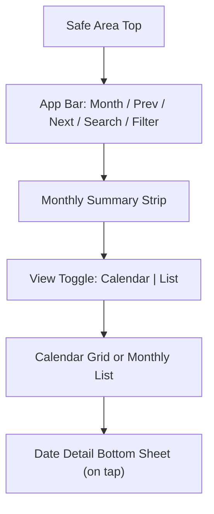
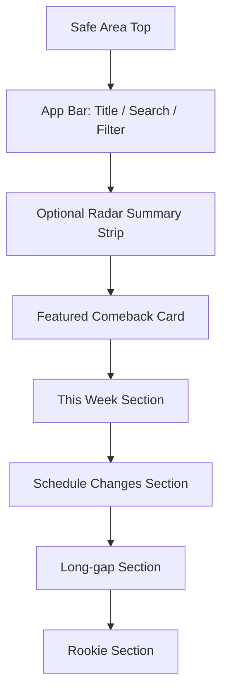
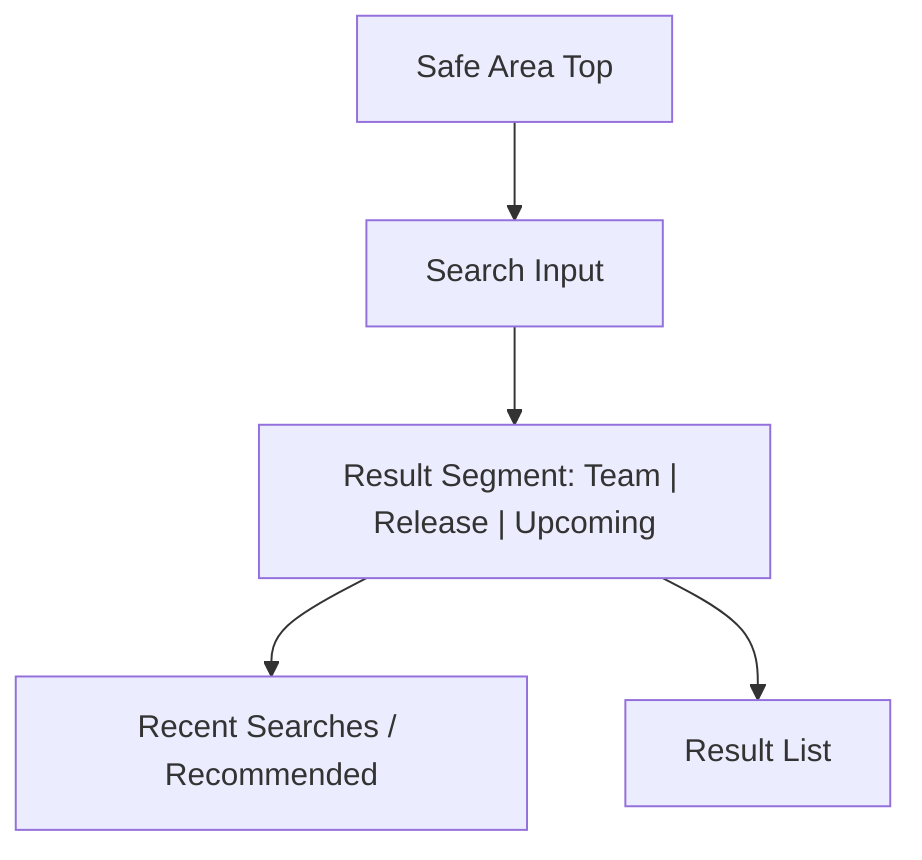
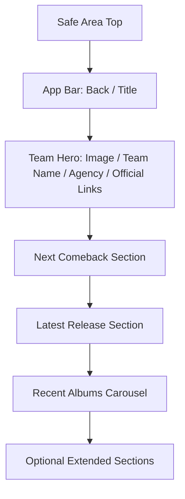
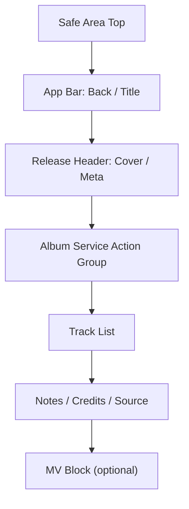
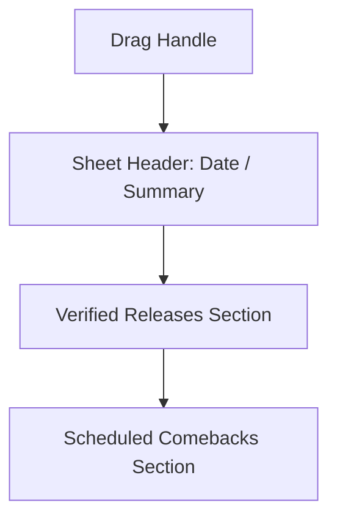
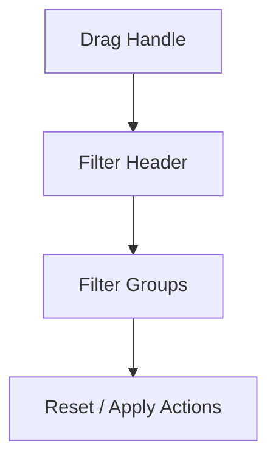

# Wireframe Block Diagrams

## 1. 목적
이 문서는 각 핵심 화면의 블록 수준 와이어 구조를 텍스트 다이어그램으로 정의한다.
정밀 UI 디자인이 없어도 개발자가 화면의 상하 구조와 sticky 영역, scroll 영역, CTA 배치를 이해할 수 있어야 한다.

## 2. Calendar Screen

### 2.1 Block Rules
- `App Bar`, `Summary Strip`, `View Toggle`는 상단 컨텍스트 블록이다.
- 기본 스크롤 주체는 `Calendar Grid` 또는 `Monthly List`다.
- `Date Detail Bottom Sheet`는 overlay drill-in이다.

## 3. Radar Screen

### 3.1 Block Rules
- `Featured Comeback Card`는 첫 화면에서 완전 노출되어야 한다.
- 각 섹션은 동일 스크롤 컨테이너 안에 배치한다.

## 4. Search Screen

### 4.1 Block Rules
- `Search Input`과 `Result Segment`는 상단 고정 허용.
- 본문은 `Recent Searches` 또는 `Result List` 중 하나를 보여준다.

## 5. Team Detail Screen

### 5.1 Block Rules
- `Team Hero`는 고정 크기 Hero가 아니라 compact header block이다.
- `Next Comeback`은 항상 `Latest Release`보다 위다.
- `Recent Albums Carousel`은 독립 가로 스크롤을 허용한다.

## 6. Release Detail Screen

### 6.1 Block Rules
- `Album Service Action Group`은 헤더 직후 첫 액션 블록이다.
- `Track List`는 화면의 가장 긴 스크롤 영역이다.
- `MV Block`은 optional이며 없으면 완전히 제거한다.

## 7. Overlay Structures

### 7.1 Date Detail Sheet

### 7.2 Filter Sheet

